# E-commerce Marketing and Sales Analysis Project

##  Business Problem Statement

The e-commerce company aims to leverage data-driven insights to enhance customer acquisition, retention, and revenue optimization strategies. This comprehensive analysis will examine transaction data from a full year (January 1, 2019 to December 31, 2019) to understand key business trends, identify growth opportunities, and develop actionable recommendations for improving marketing effectiveness and sales performance.

<div align="center">
  
</div>

<br>
The analysis will focus on critical business aspects including:
- Monthly customer acquisition and retention patterns
- Revenue contribution from new vs. existing customers
- Effectiveness of discount and coupon strategies
- Product performance and inventory optimization
- Marketing spend ROI across online and offline channels
- Customer segmentation and targeted marketing opportunities
- Impact of pricing factors (delivery charges, taxes) on purchase behavior
- Seasonal and temporal sales trends

By addressing these areas, the company aims to develop data-driven strategies to ensure consistent growth, improve customer retention, optimize marketing spend, and ultimately maximize profitability.


##  Dataset Description

The analysis utilizes five interconnected datasets covering transactions from January 1, 2019, to December 31, 2019:

### 1. Online_Sales.csv
Transaction-level point of sales data with 10 variables:

| Variable | Description |
|----------|-------------|
| CustomerID | Customer unique ID |
| Transaction_ID | Transaction unique ID |
| Transaction_Date | Date of transaction |
| Product_SKU | SKU ID -- Unique ID for product |
| Product_Description | Product description |
| Product_Category | Product category |
| Quantity | Number of items ordered |
| Avg_Price | Price per one quantity |
| Delivery_Charges | Charges for delivery |
| Coupon_Status | Any discount coupon applied |

### 2. Customers_Data.csv
Customer demographic information:

| Variable | Description |
|----------|-------------|
| CustomerID | Customer unique ID |
| Gender | Gender of the customer |
| Location | Location of customer |
| Tenure_Months | Tenure in months |

### 3. Discount_Coupon.csv
Discount coupons provided for different categories in different months:

| Variable | Description |
|----------|-------------|
| Month | Discount coupon applied in that month |
| Product_Category | Product category |
| Coupon_Code | Coupon code for the given category and month |
| Discount_pct | Discount percentage for the given coupon |

### 4. Marketing_Spend.csv
Day-wise marketing spend on both offline & online channels:

| Variable | Description |
|----------|-------------|
| Date | Date |
| Offline_Spend | Marketing spend on offline channels (TV, Radio, Newspapers, hoardings, etc.) |
| Online_Spend | Marketing spend on online channels (Google keywords, Facebook, etc.) |

### 5. Tax_Amount.csv
GST details for each product category:

| Variable | Description |
|----------|-------------|
| Product_Category | Product category |
| GST | Percentage of GST |


##  Key Business Questions

This analysis will address the following specific business questions:

#### Customer Acquisition & Retention
1. Identify months with highest/lowest acquisition rates and develop strategies to address fluctuations
2. Analyze monthly acquisition patterns and develop strategies to capitalize on high-performing months
3. Identify periods with strongest/weakest retention rates and develop improvement strategies
4. Analyze customer behavior during high-retention months to replicate success year-round
5. Compare revenue from new vs. existing customers monthly to optimize acquisition/retention balance

#### Marketing & Promotions
6. Analyze the relationship between coupon usage and revenue generation to optimize discount strategies
7. Identify top-performing products and analyze success factors to inform inventory and promotional strategies
8. Analyze monthly marketing spend vs. revenue and identify opportunities to improve ROI
9. Evaluate marketing campaign effectiveness and determine optimal resource allocation

#### Customer Segmentation & Behavior
10. Segment customers using RFM techniques (Premium, Gold, Silver, Standard) and develop targeted strategies
11. Analyze revenue contribution by segment to focus efforts on high-value customers
12. Group customers by first purchase month and analyze cohort retention rates over time
13. Analyze customer lifetime value by acquisition month to inform strategies
14. Compare average transaction values between coupon users and non-users
15. Test for significant differences in purchase behaviors across demographic groups

#### Pricing & Seasonal Analysis
16. Analyze the relationship between customer tenure and purchase frequency
17. Analyze how delivery charges affect order behavior to optimize pricing
18. Evaluate the influence of taxes and delivery charges on customer spending
19. Identify seasonal sales trends by category and location to prepare for peak periods
20. Analyze daily sales patterns to boost performance on slower days

##  Methodology

Our analytical approach will include:

1. **Data Preparation & Integration**
   - Merge the five datasets to create a comprehensive analytical view
   - Handle missing values, outliers, and data inconsistencies
   - Create derived variables for enhanced analysis (e.g., customer lifetime value, RFM scores)

2. **Exploratory Data Analysis**
   - Descriptive statistics on key business metrics
   - Time series analysis of sales and customer acquisition/retention
   - Correlation analysis between marketing spend and revenue
   - Visualization of key trends and patterns

3. **Advanced Analytics**
   - RFM (Recency, Frequency, Monetary) segmentation
   - Cohort analysis of customer retention
   - Statistical hypothesis testing for coupon effectiveness
   - Regression analysis for price sensitivity

4. **Insight Generation & Recommendations**
   - Development of actionable business insights
   - Strategic recommendations with implementation roadmap
   - KPIs for measuring success of proposed strategies


## 📂 Repository Structure

```
├── README.md                  # Project overview and documentation
├── ecommerce_analysis.ipynb   # Main Jupyter notebook with complete analysis
├── data/                      # Data files
│   ├── Online_Sales.csv
│   ├── Customers_Data.csv
│   ├── Discount_Coupon.csv
│   ├── Marketing_Spend.csv
│   └── Tax_Amount.csv
├── visualizations/            # Exported visualization images
└── formulae/                  # Collection of formulas used in EDA and metric calculations
```

<br>

--- 
## **Data-Driven Analysis : Analytical Answers to Key Business Questions**
---
### **1. Monthly Acquisition Rates**
<br>
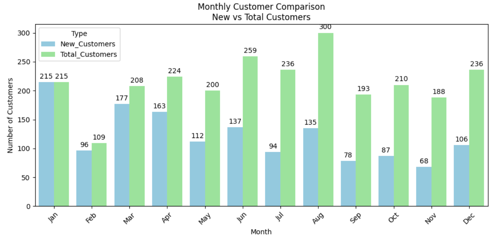

**Insights:**

* Highest acquisition: January (215 new customers)
* Lowest acquisition: November (68 new customers)
* Noticeable dips in September (78) and November; peaks in March (177) and June (137)

**Recommendations:**

* Boost low months (Sep, Nov): Run targeted campaigns, seasonal offers, and re-engagement strategies.
* Sustain high months (Jan, Mar): Replicate successful promotions and maintain momentum with referral and loyalty programs.
* Ensure consistency: Use always-on ads, personalized email marketing, and optimize acquisition funnels via A/B testing.

---
### 2. **Monthly & Quarterly Acquisition Patterns**
<br>
<div style="display: flex; gap: 20px;">
  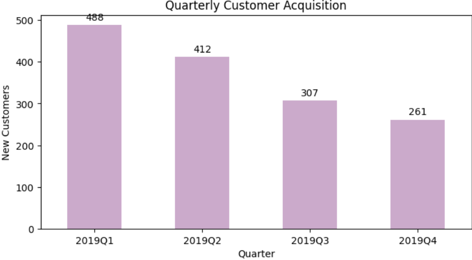
  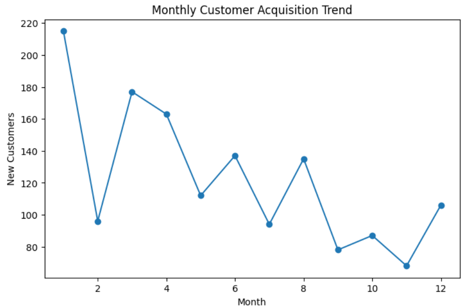
</div>

**Insights:**

* High-performing months: January, March, April — show consistently high new customer acquisition.
* Low-performing months: September, October, November — repeatedly record lower acquisition.
* Quarterly Trend: Steady decline from Q1 (488) ‚Üí Q2 (412) ‚Üí Q3 (307) ‚Üí Q4 (261), indicating reduced acquisition momentum over the year.

**Recommendations:**

* Capitalize on Q1 success: Allocate more budget and resources to amplify successful Q1 campaigns. Introduce annual subscription or bundling offers early in the year.
* Revive Q4 performance: Launch festive/holiday promotions in Q4, improve retargeting efforts, and run end-of-year clearance or loyalty campaigns.
* Bridge quarterly drops: Run mid-year engagement activities (e.g., flash sales, contests) to sustain customer interest.
* Use data-backed targeting: Analyze demographics and channels from high-performing months to optimize targeting in low-performing periods.

---
### 3. **Monthly Customer Retention Analysis**
<br>


**Insights:**
* Strongest retention months: November (63.83%), July (60.17%), September (59.59%)
* Weakest retention months: January (0%), February (11.93%), March (14.9%), April (27.23%)
* Pattern: Clear upward trend January-July; stabilization (55-64%) July-December
* Seasonal effect: November peak coincides with holiday shopping; December slight decline indicates post-holiday drop-off

**Recommendations:**
* Q1 Re-engagement Campaign: Implement targeted win-back campaigns for holiday shoppers; introduce "New Year" promotions exclusively for existing customers
* Loyalty Program Enhancements: Offer additional benefits during Q1; implement tiered rewards and bonus points February-March
* Strategic Discounting: Design graduated discount structure with deeper Q1 discounts; offer free shipping January-April
* Engagement Calendar: Develop content focused on low-retention periods; host online events and product demonstrations in Q1
* Early Intervention System: Implement churn prediction models; create automated touchpoints for at-risk customers during vulnerable periods

####  Summary Table

| Period       | Retention Rate | Classification | Strategy                                                    |
| ------------ | -------------- | -------------- | ----------------------------------------------------------- |
| Jan–Mar 2019 | 0–14.9%        | Weakest        | Improve onboarding, early engagement, collect exit feedback |
| Apr–Jun 2019 | 27–47%         | Moderate       | Add value nudges, engage inactive users, early rewards      |
| Jul–Nov 2019 | 55–64%         | Strongest      | Analyze what worked, replicate in weaker months             |
| Dec 2019     | 55.08%         | Slight dip     | Compensate for seasonality with engagement campaigns        |

---

### 4. **High-Retention Month Customer Behavior Analysis**

**Insights:**
* Top retention periods: November (63.83%), July (60.17%), and September (59.59%) demonstrate exceptional customer loyalty
* Behavior patterns: During high-retention months, customers likely respond to seasonal promotions (July summer sales, November holiday shopping)
* Stability factor: The July-November period maintains consistently strong retention (55-64%), suggesting effective mid-to-late year engagement strategies
* Seasonal correlation: Peak retention coincides with major shopping seasons and promotional periods

**Recommendations:**
* Replicate seasonal campaign structures: Adapt successful holiday and summer promotional frameworks for off-peak months
* Implement consistent communication cadence: Mirror the frequency and style of customer communications used during high-retention months
* Extend loyalty incentives: Apply the same rewards structure from high-retention months to low-performing periods
* Create artificial shopping events: Develop "mini-seasons" during Q1 with themed promotions that mimic successful holiday campaigns
* Analyze and apply purchase triggers: Identify what motivates purchases during high-retention periods and incorporate these elements year-round
---

### **5. New vs. Existing Customer Revenue Balance**
<br>
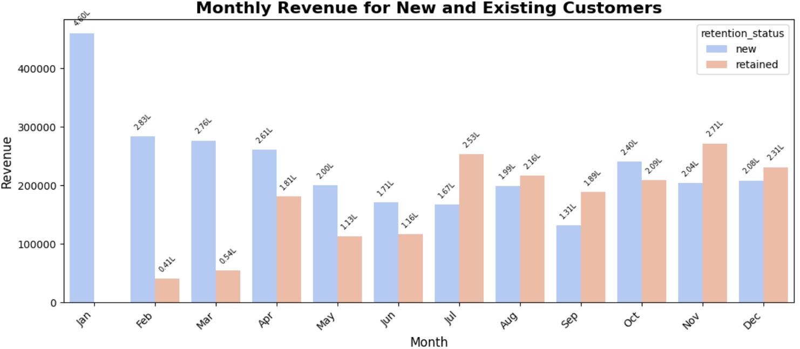

**Insights:**

* Q1 Acquisition Surge: Jan–Mar show highest new customer revenue (Jan: 461K), with low retention.
* Mid-Year Shift: May marked the start of significant retained revenue (181K vs. 200K new).
* Retention Dominance: From July onward, retention consistently exceeded acquisition, peaking in Nov (271K vs. 204K).
* Balanced Year-End: Dec maintained strong retention (231K) alongside stable acquisition (208K).
* Crossover Point: Transition from acquisition-led to retention-led revenue occurred between Apr–Jul.

**Recommendations:**

* Strategic resource allocation: Prioritize acquisition campaigns in Q1, gradually shifting budget toward retention in Q2-Q4
* Customer lifetime value focus: Develop early onboarding programs for Q1 customers to maximize their long-term value
* Balanced marketing approach: Maintain 60-40 acquisition-retention spend ratio in Q1, shifting to 40-60 in Q3-Q4
* Retention reinforcement: Strengthen loyalty programs and personalization efforts in July-December to capitalize on proven retention success
* Customer journey optimization: Create seamless transition from new customer offers to retention-focused value propositions around the April-May period
---

### **6. Coupon Usage vs Revenue Impact**

<br>
<div style="display: flex; justify-content: center; gap: 20px; align-items: flex-start;">
    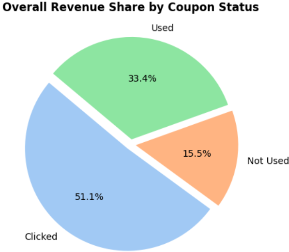
    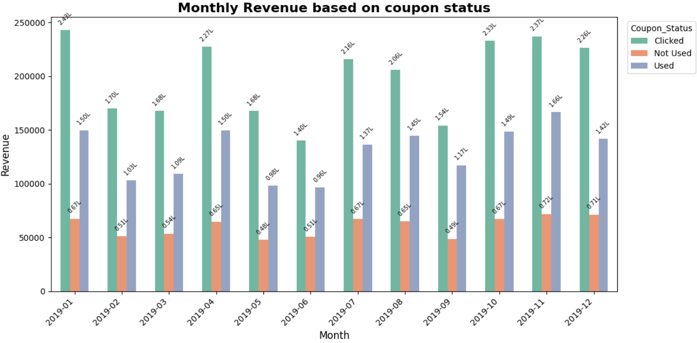
</div>

**Insights:**

* Clicked coupons drive the most revenue (51.1%) even without redemption, showing strong impact of visibility
* Used coupons contribute 33.4% revenue, indicating high conversion when redeemed
* Not used coupons still contribute 15.5%, suggesting exposure alone can influence purchases

**Recommendations:**

* Maximize coupon visibility through banners, prompts, and placements
* Experiment with lower discounts paired with high visibility for better ROI
* Introduce urgency elements like timers or gamified redemption
* Retarget users who clicked but did not redeem
* Track margins by coupon type to ensure profitability

---

### **7. Top-Performing Products and Success Drivers**

<br>

**5 Top Performing products (Based on Quantity)**
<div style="display: flex; justify-content: center; gap: 20px; align-items: flex-start;">
    
    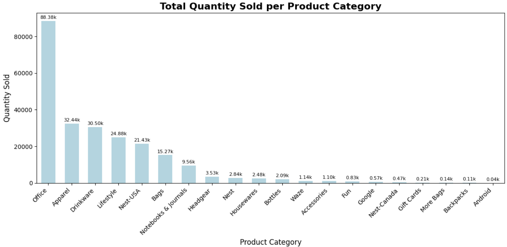
</div>
<br>

**5 Top Performing products (Based on Revenue)**
<div style="display: flex; justify-content: center; gap: 20px; align-items: flex-start;">
    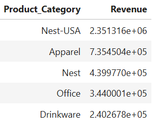
    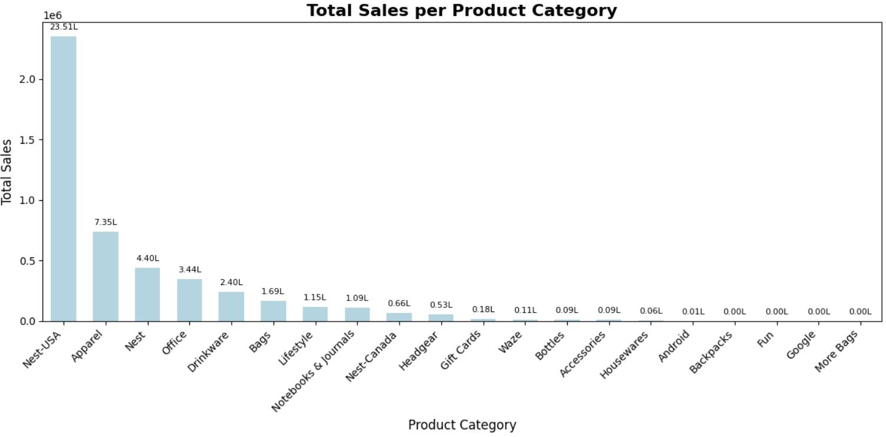
</div>


**Insights:**

* Office category has the highest quantity sold (88.38k units) but ranks fourth in revenue, indicating it’s a high-volume, low-price product line.
* Nest-USA is the top revenue generator (\$2.35M+) despite being fifth in quantity sold (21.43k), suggesting high unit price or profit margin.
* Apparel performs well both in quantity (32.44k) and revenue (\$735k), showing consistent demand and decent pricing.
* Drinkware and Lifestyle also rank high in quantity sold but generate comparatively lower revenue, reinforcing the price sensitivity of these categories.
* Nest (distinct from Nest-USA) shows strong revenue generation with minimal quantity sold, reinforcing its high-value nature.

**Recommendations:**

* Focus inventory planning on high-volume products like Office, Apparel, and Drinkware to avoid stockouts and maintain sales momentum.
* Maintain optimized, lower stock levels for high-value categories like Nest and Nest-USA to minimize holding costs while capturing premium sales.
* Use high-margin products like Nest-USA in targeted campaigns or exclusive promotions to drive profitability rather than volume.
* Promote bundle offers for high-volume categories to increase average order value and clear inventory faster.
* Prioritize dynamic pricing and product positioning strategies for top revenue generators to maximize their potential without relying solely on volume.
---
### **8. Monthly Marketing Spend vs Revenue Analysis**

<br>

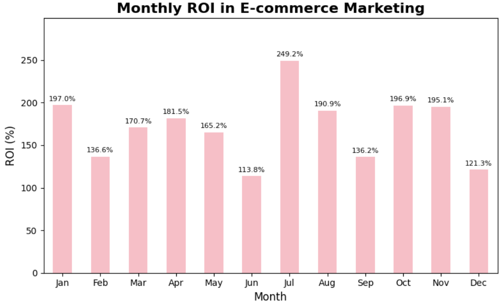

<br>

**Insights:**

* July has peak ROI (249%) with modest spend—very efficient.
* June, December, Feb, and Sep show low ROI despite high spend—inefficient months.
* Jan and Oct deliver high ROI (\~197%) with balanced budgets.

**Recommendations:**

* Replicate July, Jan, and Oct strategies.
* Reoptimize or cut spend in June, Dec, Feb, Sep.
* Redirect budget toward high-ROI months.
* Use testing and forecasting to fine-tune monthly spend.
---

### **9. Effectiveness of Marketing Campaigns**

<br>
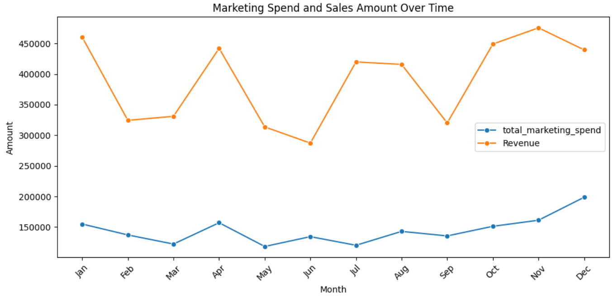

**Insights:**

* Jul stands out with low spend and high revenue—most efficient.
* Dec and Jun had high spend but poor ROI—inefficient allocation.
* Jan and Oct show high ROI with relatively balanced investment.

**Recommendations:**

* Reduce budget in Jun and Dec; reinvest in Jul, Jan, and Oct.
* Conduct deep dives into top-performing months to replicate tactics.
* Test campaigns in underperforming periods before scaling budget.
---
### **10. Customer Segmentation (RFM Analysis)**
<br>
<div style="display: flex; justify-content: center; gap: 20px; align-items: flex-start;">
    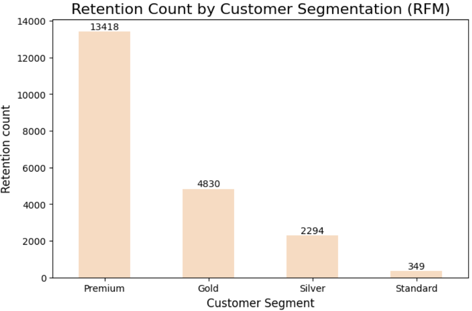
    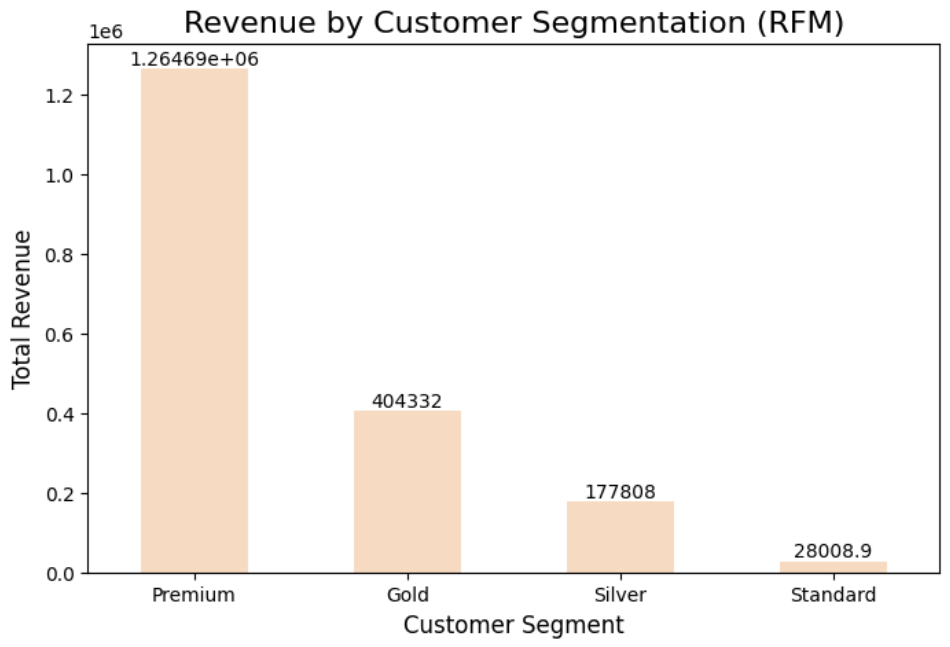
</div>
<br>

**Segmentwise count of customers**

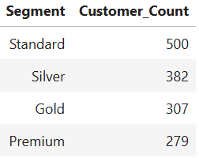
<br>

**Insights:**

* **Standard** has the highest customer count but lowest revenue and retention.
* **Premium** customers are fewest but yield the highest revenue and retention.
* **Gold** and **Silver** offer balanced opportunities with moderate performance.
* Average revenue per Premium customer is \~80x higher than Standard.

**Recommendations:**

* Focus retention efforts on **Premium** with loyalty perks and exclusive deals.
* Upsell **Gold** to Premium through personalized offers.
* Re-engage **Silver** via targeted campaigns and incentives.
* Improve onboarding and engagement strategies for **Standard** segment.

---
---

### **11. Revenue Contribution by Customer Segment**

<br>
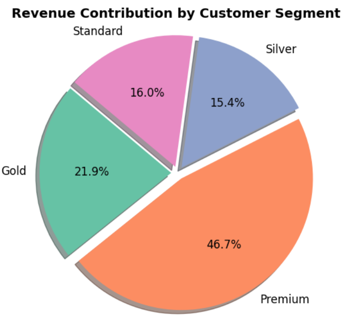

**Insights:**

* **Premium** segment drives nearly half of total revenue (46.7%) despite being the smallest in customer count.
* **Gold** contributes 21.9%—a strong mid-tier segment with potential to upgrade.
* **Standard** and **Silver** combined bring in \~31% of revenue, indicating low individual value.

**Recommendations:**

* Prioritize **Premium** with tailored retention strategies and premium experiences.
* Upsell **Gold** customers using personalized journeys and exclusive upgrade incentives.
* Nurture **Standard** and **Silver** with lifecycle campaigns aimed at increasing engagement and spend.
* Use insights from **Premium** behavior to design targeted growth tactics for lower segments.

---
### **12. Customer Retention by Cohort**

<br>
<br>
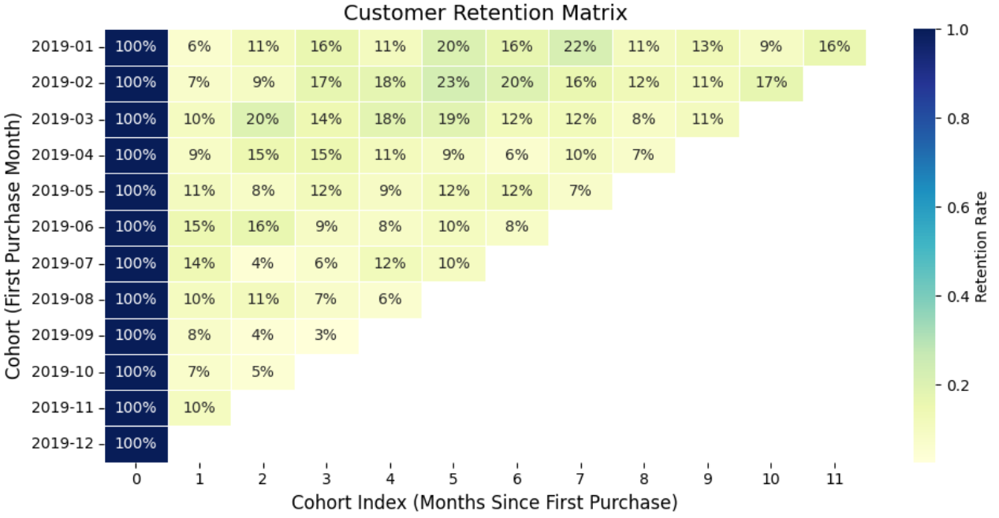

**Insights:**

* **Feb and Mar 2019 cohorts** show relatively high mid-term retention (17–23%) around months 3–5.
* **Jun 2019 cohort** also shows solid early retention (up to 16%) in months 1–2.
* **Jul–Oct 2019 cohorts** exhibit sharp drop-offs in retention within first 3 months—lowest overall.
* Retention is generally declining over time, indicating reduced stickiness for newer cohorts.

**Recommendations:**

* Analyze high-performing cohorts (Feb–Mar) to identify successful onboarding or engagement patterns.
* Implement targeted win-back campaigns for recent weak cohorts (Jul–Oct)- Reconnect with customers who dropped off early (especially Jul–Oct groups) through personalized follow-ups or offers.
* Introduce loyalty rewards or milestone incentives around months 1–3 to prevent early churn.
* Regularly monitor cohort retention to fine-tune post-purchase engagement strategies.

---

### **13. Lifetime Value (LTV) by Acquisition Month**

<br>
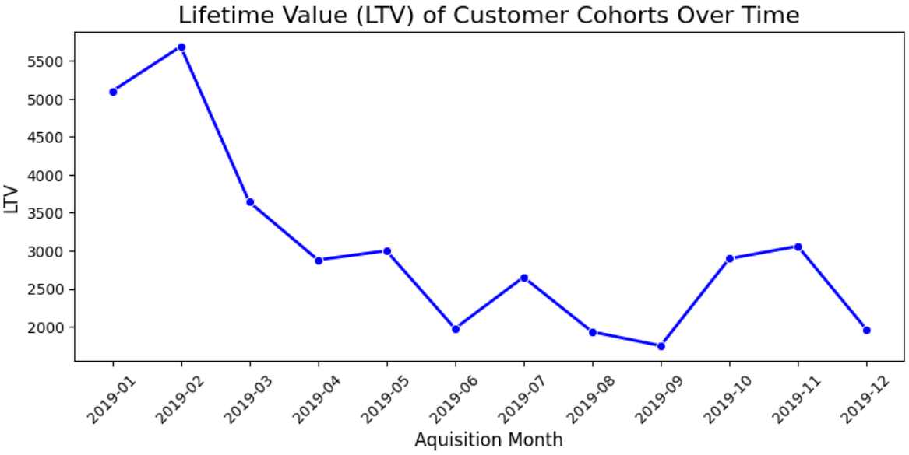

**Insights:**

* Customers acquired in Jan and Feb 2019 had the highest LTV, peaking above 5500.
* LTV sharply declined after March, with the lowest values observed from Jun to Sep.
* Minor recovery in Oct and Nov, but Dec again shows a drop.

**Recommendations:**

* Focus acquisition efforts on periods like Jan–Feb—analyze what drove long-term value then (e.g., onboarding, promotions).
* Reevaluate acquisition channels and messaging from mid-2019; optimize to target high-intent users.
* Use retention campaigns (e.g., loyalty perks, re-engagement emails) for mid- and late-year cohorts to improve LTV.
* Consider lifetime value when budgeting for customer acquisition—not just initial conversion cost.

---

### **14. Do Customers Who Use Coupons has different average transaction value?**
<br>
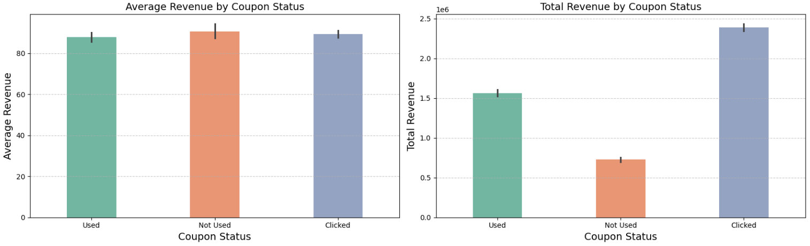
    
**Insights:**
* A **One-Way ANOVA test** was used to compare the average transaction revenue across three coupon status groups: *Used*, *Not Used*, and *Clicked*.
* p-value = 0.3708 ‚Üí No statistically significant difference in average revenue across the groups.
* This means customers spend roughly the same on average, regardless of whether they use, click, or ignore coupons.
* While average revenue is similar across groups, total revenue is highest for the Clicked group.
* This suggests that coupon engagement (clicks) drives more total sales, even if it doesn’t increase individual order size.
 
**Recommendations:**
* Coupons don't boost transaction value but can increase overall revenue by encouraging more purchases.
* Strategy should focus on optimizing coupon visibility and click-through, not necessarily on increasing discount amounts.

---

### **15. Variation in Purchase Behavior Across Demographics & Pricing Factors**

<br>

### **Insights:**
<br>
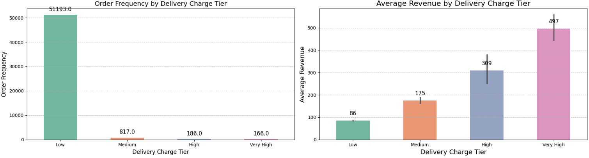

* **Delivery Charge Tiers:**

  * Majority of orders (51,193) are placed in the Low delivery charge tier.
  * Despite very low frequency in the “Very High” tier (166 orders), average revenue per order is highest (\~₹497).
  * Higher delivery fees correlate with higher average order values, indicating premium product sales.
---

<br>
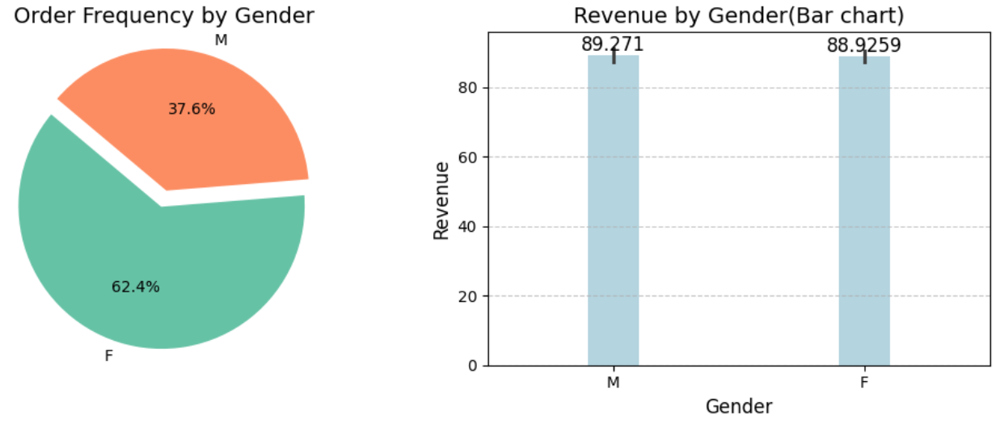
<br>
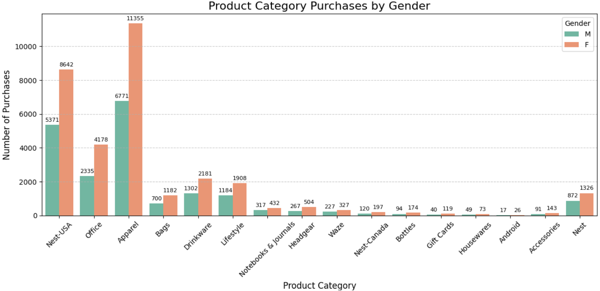
<br>

* **Gender:**

  * Female customers contribute 62.4% of total orders, showing stronger purchase frequency.
  * Revenue per order is similar across genders (M: ‚Çπ89.27, F: ‚Çπ88.92), suggesting similar spending patterns.
  * Category preferences differ: Women dominate Apparel, Office, and Lifestyle; Men lead in Tech/Nest-USA categories.
    
---
<br>

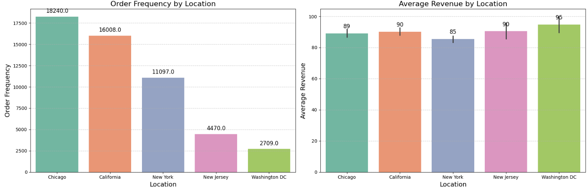

* **Location:**

  * Chicago and California show the highest order volumes (18,240 & 16,008 respectively).
  * Washington DC, while low in order count (2,709), records the highest average revenue per order (‚Çπ95).
  * Indicates some regions prefer quality over quantity purchases.
---    
<br>

**Recommendations:**

* Personalized Pricing:
  * Introduce tiered delivery pricing incentives (e.g., discounts for Medium tier) to shift more users from Low to higher revenue segments.
  * Target high-delivery-charge customers with premium bundles or loyalty perks.

* Demographic Targeting:
  * Run product-specific ads: Apparel, Office, and Bags for females; Tech and Nest products for males.
  * Use gender-based segmentation in email campaigns and recommendation engines.

* Geo-targeted Promotions:
  * Boost low-order yet high-revenue locations (e.g., Washington DC) with premium product catalogs.
  * Focus acquisition efforts on high-order locations (Chicago, California) using referral/discount campaigns.

* Cross-leverage behavior insights:
  * Combine delivery tier and location data to optimize pricing models per region.
  * Use behavioral clustering to refine customer personas for better targeting.

---


### **16. Impact of Customer Tenure on Purchase Frequency**

<br>
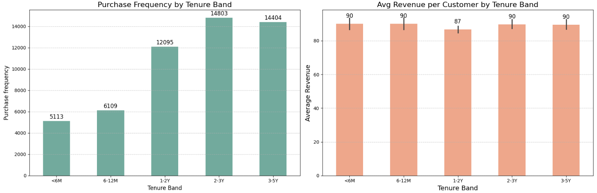

**Insights:**

* Purchase frequency increases steadily with tenure, peaking at 2–3Y (14,803 orders) and slightly declining at 3–5Y (14,404 orders).
* Customers with tenure less than 6 months show the lowest engagement with only 5,113 orders.
* Average revenue per customer remains relatively stable across all tenure bands at around ‚Çπ90.

**Recommendations:**

* Improve early-stage engagement for new customers by offering onboarding incentives, personalized communication, and early loyalty benefits.
* Strengthen mid-tenure customer relationships through targeted promotions, product recommendations, and exclusive offers.
* Maintain long-tenure customer interest with milestone rewards, VIP perks, and community engagement.
* Monitor customer behavior after 3 years to identify potential signs of churn and launch proactive re-engagement strategies.

---


### **17. Impact of Delivery Charges on Order Behavior**
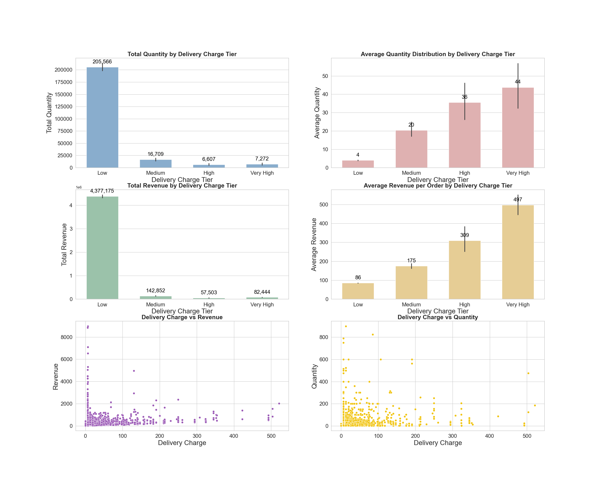

**Insights:**

* Orders with low delivery charges dominate in quantity (205,566 units) and total revenue (‚Çπ4.37M), despite having the lowest average revenue per order (‚Çπ86).
* As delivery charge tier increases, total quantity and revenue drop significantly, but average order value rises—up to ₹497 for very high charges.
* Higher delivery charges are linked with lower order volumes but significantly higher order values, suggesting premium purchases.
* Scatter plots show dense clusters of low-charge, low-revenue and low-quantity orders; higher charges are less frequent but more profitable per order.

**Strategic Insights:**

* Maintain low delivery charges for mass-market products to sustain volume and broad customer base.
* Introduce tiered delivery pricing aligned with order value thresholds to encourage customers to increase basket size for better value.
* Promote free or discounted delivery for high-volume orders to balance profitability and customer satisfaction.
* Test targeted pricing strategies (e.g., free delivery over a certain spend) to optimize revenue without sacrificing quantity.

---

---

### **18. Impact of Taxes and Delivery Charges on Customer Spending**
<br>
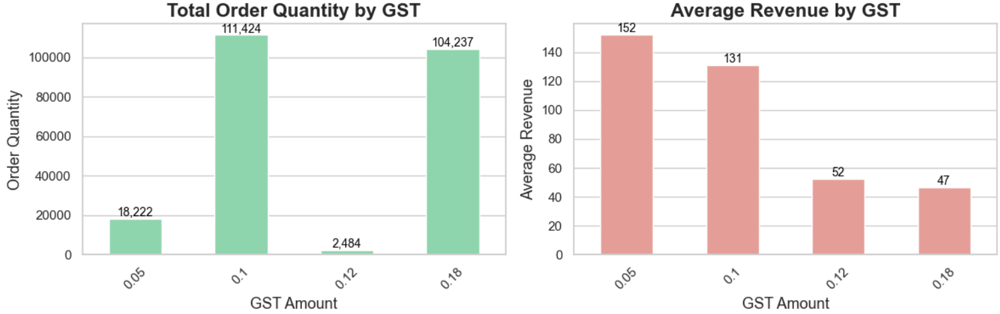


**GST for Product category:**
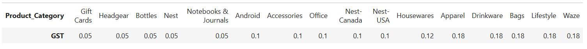

**Insights:**

* GST tiers of 0.05 and 0.10 are associated with the highest order volumes and total revenue, with 0.10 contributing over 2.7 million in revenue and 111,000 units sold.
* Higher GST tiers of 0.12 and 0.18 show reduced order frequency and lower average revenue per order, suggesting customer price sensitivity.
* Orders with low delivery charges account for the majority of quantity and revenue, indicating strong preference for lower shipping costs.
* As delivery charges increase, total order volume declines while average revenue per order increases, reflecting a shift toward fewer high-value transactions.

**Recommendations:**

* Prioritize promoting products in low to mid GST brackets to maximize reach and revenue.
* Evaluate reducing delivery charges or offering free shipping thresholds to boost order volumes.
* Introduce delivery charge optimizations, such as bundling or tier-based discounts, to maintain high order value while improving affordability.
* Monitor performance of high-GST, high-delivery-charge items and explore targeted offers or tax-inclusive pricing to improve conversion.

---

### **19. Seasonal Sales Trends by Category and Location**
<br>
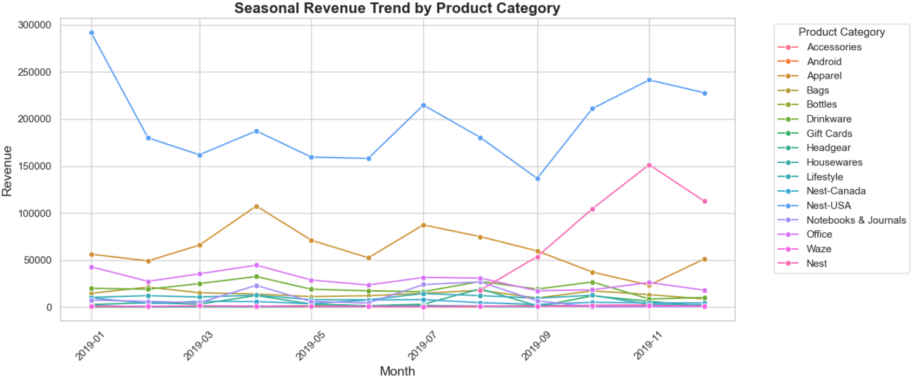
<br>
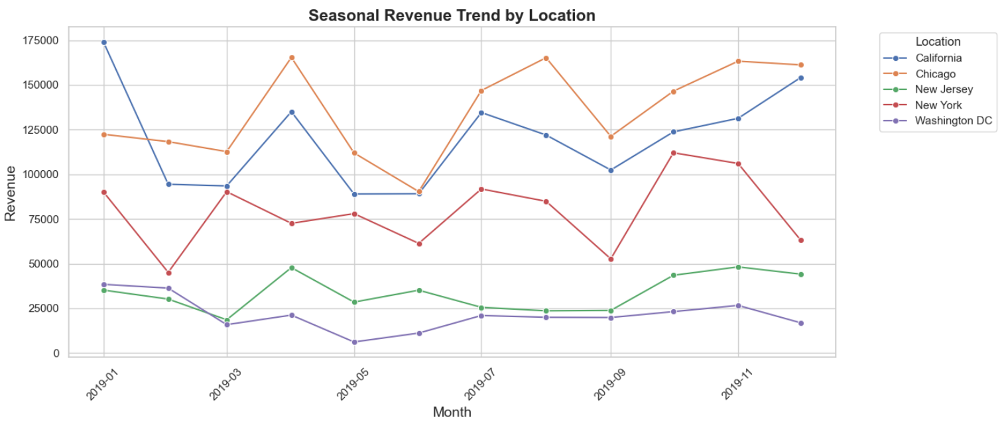
<br>

**Insights:**

* Sales peak in Q4 (Oct–Dec) across most categories, driven by holiday and festive shopping.
* Categories like Clothing, Electronics, and Home Decor show strong seasonal spikes, especially in urban and metro regions.
* Q2 (Apr–Jun) is generally off-peak for most categories.
* Groceries and Health Products maintain steady sales year-round.

**Recommendations:**

* Align inventory and staffing with peak periods to meet demand and reduce costs during off-peak times.
* Launch targeted, location-specific campaigns before peak seasons to boost high-demand categories.
* Promote essential categories during off-seasons with bundles or limited-time offers.
* Use historical seasonal data for demand forecasting, pricing strategies, and campaign planning.

---

### **20. Daily Sales Trends and Optimization Strategies**

<br>
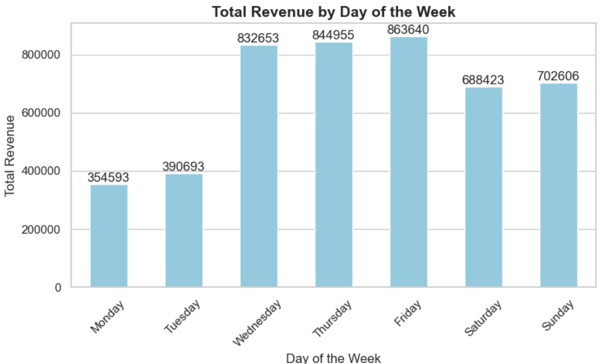
<br>

**Insights:**

* Highest revenue is observed on Friday, followed by Thursday and Wednesday.
* Monday and Tuesday are the weakest sales days.
* Weekend sales (Saturday and Sunday) are moderate but lower than peak weekdays.

**Recommendations:**

* Run exclusive Monday–Tuesday deals or flash sales to boost early-week activity.
* Use retargeting ads and email campaigns after weekend visits to convert hesitant buyers.
* Offer weekday-only incentives like free shipping or loyalty points.
* Analyze product performance by day to align promotions with likely purchase behavior.

<br>

---
##  **Overall Summary of Insights & Strategic Recommendations**
---
###  **Key Insights**

1. Customer Acquisition & Retention Trends

   * Q1 excels in acquisition but suffers from poor retention.
   * Q3 & Q4 show high retention, especially Nov (63.8%), but acquisition declines.
   * Acquisition declines progressively through the year: Q1 > Q2 > Q3 > Q4.

2. Revenue Distribution

   * New customers drive revenue in Q1, but by mid-year, retained customers take over.
   * Crossover point: Around May–July, focus should shift from acquisition to retention.

3. Coupon Effectiveness

   * Clicked coupons (even unused) drive over 50% of revenue—visibility alone is impactful.
   * Used coupons convert well (33.4%), validating discounts.

4. Seasonality Patterns

   * High engagement during holiday seasons (Nov) and mid-year sales (Jul).
   * Retention and revenue spike during these events.

---

###  **Strategic Recommendations**

1. Acquisition-Focused Q1 Strategy

   * Allocate higher budget in Q1 for acquisition: use new year campaigns, referral incentives.
   * Improve onboarding and early engagement to enhance retention later.

2. Retention-Centric Q3–Q4 Approach

   * Shift to personalization, loyalty programs, and reactivation campaigns from July onward.
   * Use successful July–Nov frameworks (e.g., summer/holiday sales) in off-peak months.

3. Sustain Mid-Year Revenue

   * Bridge Q2 drop with flash sales, contests, loyalty perks.
   * Analyze top-performing user behavior from high-retention months and replicate tactics.

4. Coupon Optimization

   * Increase coupon exposure via visible placements—even if not redeemed.
   * Use timed offers/gamified discounts to nudge conversions.
   * Track and test low-discount high-visibility coupons for profitability.

5. Balanced Budgeting Model

   * Adopt 60:40 spend ratio (acquisition\:retention) in Q1, invert to 40:60 from Q3 onward.
   * Sync marketing efforts with quarterly performance patterns to improve ROI.

6. Customer Journey Continuity

   * Seamlessly transition new users into retention workflows from April–May.
   * Use predictive churn models and automate engagement for at-risk users.

---
